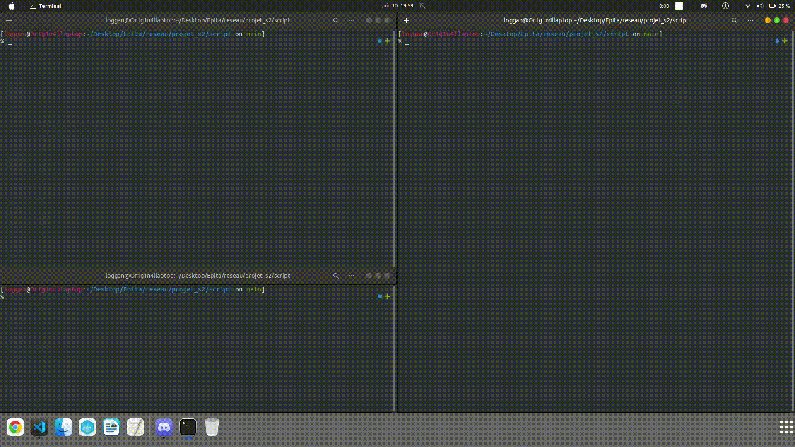

# HybridShare

HybridShare is a versatile file-sharing application that employs a hybrid model, combining both client-server and peer-to-peer architectures. This solution allows users to share files efficiently in various network environments. 

For "Alice" and those who want to share files:

- Alice can share her files by registering with the system, breaking her files into manageable 1024-byte chunks, and responding to requests from others for specific file segments.

For "Bob" and those who want to download files:

- Bob can easily retrieve files from participants using a central tracker. He assembles the file by requesting its length, downloading individual chunks, and handling potential errors gracefully.

## Demonstration

## Installation

You can install the project by cloning the repository with the following command:

```
git clone https://github.com/Hellcat-IV/HybridShare.git
```

## Usage

First of all you need to start the tracker (server) with the following command:

``` 
python3 tracker.py
```

Then you can start Alice (uploader) with the following command:

```
python3 alice.py
```

Finally you can start Bob (downloader) with the following command:

```
python3 bob.py
```

Make sure to watch the [demonstration](#demonstration) before using the application.

## RFC Documentation
[Click here](docs/RFC.md) to see the RFC documentation.

## Contributors

- [@Kenoor](https://github.com/bxsic-fr) 
- [@Valmar](https://www.github.com/CalValmar) 
- [@Aymenkaze](https://github.com/Aymenkaze)

## License

This project is licensed under the GNU GPLv3 License - see the [LICENSE](LICENSE) file for details.
